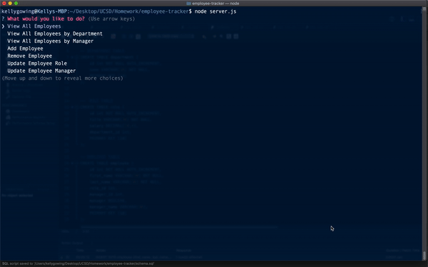

# Unit 12 MySQL Homework: Employee Tracker

## Project Preview



## Project Description 

Developers are often tasked with creating interfaces that make it easy for non-developers to view and interact with information stored in databases. Often these interfaces are known as **C**ontent **M**anagement **S**ystems. This project is a solution for managing a company's employees using node, inquirer, and MySQL.

## Project Goals

  * Add departments, roles, employees

  * View departments, roles, employees

  * Update employee roles

## User Story

```
As a business owner
I want to be able to view and manage the departments, roles, and employees in my company
So that I can organize and plan my business

```
## Future Development
- Functions `addEmployee()`, `updateRole()`, & `updateManager` are NOT complete.
- - -
© 2019 Trilogy Education Services, a 2U, Inc. brand. All Rights Reserved.
